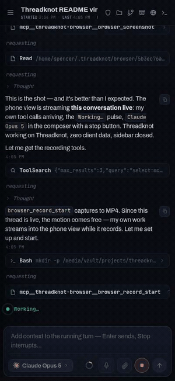

# Threadknot 🧵

**Every coding agent on one thread.** A Tauri (Rust) desktop app that drives
Claude Code, OpenAI Codex, Kimi Code, and remote Hermes gateways natively over
their wire protocols — no terminal wrapping, no Node server — and serves the
same UI to any browser on your LAN, so you can drive your agents from your
phone.

<p align="center">
  
  <br>
  <em>The same UI a phone gets, streaming a live agent turn over the LAN.<br>
  (That's Threadknot working on Threadknot.)</em>
</p>

## Install

Grab the latest build for your platform from
[**Releases**](https://github.com/smith-network-solutions/threadknot/releases) —
a `.deb`/`.rpm` on Linux, an installer on Windows, a binary on macOS. Each
release also ships `threadknot-headless`, the LAN server on its own.

You also need at least one agent CLI installed and already logged in — see
[Prerequisites](#prerequisites). Building from source is covered under
[Build & run](#build--run).

## How it works

```
┌───────────────────────────────────────────────┐
│ Tauri shell (desktop window)                  │
│   └─ React UI  ←────────────┐                 │
├─────────────────────────────┼─────────────────┤
│ Rust core (threadknot_lib)  │  same UI, phone │
│   axum server :42800 ───────┴──── browser ────┼──→ http://<lan-ip>:42800/?token=…
│   ├─ /ws  (token-gated JSON protocol)         │
│   ├─ /browser (shared Chrome screencast)      │
│   ├─ /mcp (agent browser + artifacts)         │
│   ├─ agent hub (events → JSONL + fanout)      │
│   ├─ claude driver ── spawns `claude`         │   stream-json + control_request
│   ├─ codex driver ─── spawns `codex`          │   app-server (JSON-RPC/stdio)
│   ├─ kimi driver ──── spawns `kimi acp`       │   ACP (JSON-RPC/stdio)
│   ├─ claudex ──────── `claude` + gateway env  │   any model, Claude harness
│   └─ hermes driver ── remote gateway          │   Runs API (HTTP + SSE)
└───────────────────────────────────────────────┘
```

- **Auth is your existing subscriptions**: the local drivers spawn the
  installed `claude`, `codex`, and `kimi` CLIs, which use their own
  `claude login` / `codex login` / `kimi login` credentials. No API keys for
  the local agents. (The two gateway-backed kinds — Hermes and Claudex — are
  the exception: you register a base URL and key per gateway.)
- **Projects are folders**; each thread runs one agent in that folder with its
  own model / effort / access / plan-build settings.
- **Everything is event-sourced**: normalized agent events are appended to
  `~/.threadknot/threads/<id>.jsonl` and broadcast to every connected client, so
  desktop and phone stay in sync and threads replay on reconnect.
- Provider sessions resume: Claude via `--resume <session_id>`, Codex via
  `thread/resume`, and Kimi via ACP `session/resume`.
- **Agent and human share one browser:** the agent gets semantic page snapshots
  and deterministic browser tools while the Browser workspace shows the same
  live Chrome, including the agent cursor, target, action status, and failures.
  You can take over its mouse and keyboard at any time.

Protocol contract: [`docs/PROTOCOL.md`](docs/PROTOCOL.md). Codex app-server
schemas vendored in [`docs/protocol/`](docs/protocol/).

## Controls (per thread)

| Control | Options |
|---|---|
| Agent | Claude Code, Codex, Kimi Code, Hermes (remote gateways), Claudex (Claude harness + any model) |
| Model | Claude: Fable 5 / Opus 5 / Sonnet 5 / Haiku 4.5 · Codex: discovered via `model/list` · Kimi: K3 / K3 256K / K2.7 Code |
| Effort | K3: low / high / max (high default) · other models expose their supported levels (+ **1M context** toggle on supported Claude models via the `[1m]` suffix) |
| Access | **Read-only** (ask for everything) / **Edits** (auto-accept edits) / **Full** (no prompts) |
| Mode | **Plan** (read-only planning, plan approval card → one-click "Approve & build") / **Build** |

## Prerequisites

- **Rust** (stable) and **Node 22+**.
- **Platform toolchain for Tauri's webview stack.** On Linux:
  ```bash
  sudo apt-get install -y libwebkit2gtk-4.1-dev libayatana-appindicator3-dev \
      librsvg2-dev libgtk-3-dev libssl-dev patchelf
  ```
  macOS needs the Xcode command-line tools; Windows needs the MSVC build
  tools. Linux is the primary development target and gets the most testing.
- **The agent CLIs you intend to drive**, installed and *already logged in*:
  `claude`, `codex`, `kimi`. Threadknot does not handle auth — it reuses each
  CLI's own subscription login, so every person runs against their own account.
  An agent you are not logged into shows as unavailable in the composer;
  nothing else breaks.

The first build compiles the full dependency tree and takes a while. Later
builds are incremental.

## Develop

```bash
npm install
npm run tauri dev          # desktop app w/ vite HMR (port 1430)
```

## Build & run

```bash
npx tauri build --no-bundle                      # desktop app
./src-tauri/target/release/threadknot            # desktop app
./src-tauri/target/release/threadknot-headless   # LAN server only, prints URL
```

> Build the desktop app with the **Tauri CLI**, as above. A plain
> `cargo build --release` produces a binary with no UI embedded: it tries to
> load the dev server and opens on "Could not connect to localhost".
> `npx tauri build` runs `npm run build` for you.

Server state: `~/.threadknot/` (`server.json` holds the port + access token —
delete it to rotate the token). Override port with `THREADKNOT_PORT`, UI location
with `THREADKNOT_DIST`.

Upgrading from Armada? Nothing is migrated: an existing `~/.armada` keeps being
used, in place. See "Rename compatibility" in `CLAUDE.md`.

## Phone access

Open Settings (gear, bottom of sidebar) in the desktop app and open/copy the
LAN URL — e.g. `http://192.168.0.54:42800/?token=…` — on any device on your
network. The token persists in the browser after first load.

## Credits

Threadknot started as a port of [t3code](https://github.com/pingdotgg/t3code)'s
agent integration into a from-scratch, all-Rust stack. t3code worked out how to
drive these CLIs natively in the first place — Claude's stream-json transport
and its `control_request` permission handshake, Codex's app-server JSON-RPC —
and Threadknot's drivers reimplement that layer rather than reinvent it. A
handful of pieces are direct ports and say so at the top of the file:
`ContextMeter`, the Codex wire integration, the port scanner, and the
streamable-HTTP MCP endpoint.

t3code is MIT-licensed, © 2026 T3 Tools Inc. Full notice in
[`THIRD-PARTY-NOTICES.md`](THIRD-PARTY-NOTICES.md). Thanks to the t3 team —
this project would have taken a great deal longer without their work to read.
